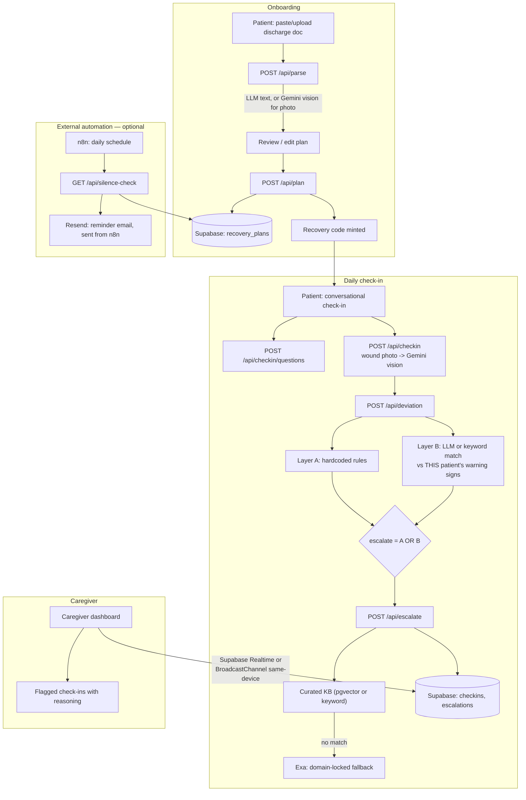

# Homeward

A post-discharge aftercare assistant that turns a hospital discharge summary into a day-by-day
recovery plan and flags when a patient drifts from their own doctor's instructions.

## Links

- **Live demo:** https://homeward-mauve.vercel.app
- **Demo video:** TODO
- **Try without signing up** (fictional demo data — this is a prototype, not for real patient data):
  - Patient view: https://homeward-mauve.vercel.app/patient?code=DEMO01
  - Caregiver view: https://homeward-mauve.vercel.app/caregiver?code=DEMO01

## The problem

Patients leave hospital with a discharge summary — medications, wound-care instructions,
activity restrictions, a follow-up date, and doctor-stated warning signs — that's easy to lose
track of at home. There's no simple way to notice a patient quietly drifting from what their
own doctor told them, or to loop in a caregiver before something becomes urgent.

Homeward addresses this with a five-stage flow:

1. **Parse** a discharge summary (text or photo) into structured data.
2. **Build** a day-by-day recovery plan from it (medication schedule, wound-care checklist,
   milestones).
3. **Daily check-in** — the patient answers a short conversational check-in (fixed-choice
   questions + optional free text + optional wound photo).
4. **Two-layer safety check** — the check-in is compared against universal red flags and this
   specific patient's own instructions.
5. **Escalation** — anything flagged produces a structured summary the caregiver sees, with the
   reasoning behind it; a calm day produces a plain reassurance instead.

**Design principle: the AI extracts and tracks. The patient's own doctor's instructions are the
source of truth. Homeward never diagnoses.** Any ambiguous or concerning signal routes to a
human — never a verdict from the app itself.

The recovery plan itself is fixed once created — Homeward tracks *deviation from that plan* over
time via daily check-ins, with escalation to the caregiver as soon as a check-in is submitted;
it does not revise or evolve the plan itself.

### Roles

| Role | Capabilities |
|---|---|
| Patient | Upload/paste a discharge summary or fill it in manually; review the extracted plan; do a daily check-in; tap an "I'm okay" presence ping on a day they can't do a full check-in; ask the "Ask Homeward" widget plan-specific questions |
| Caregiver | Read-only view of the same plan and day-by-day timeline; a running list of flagged check-ins with full reasoning; optionally, an email reminder if the patient goes quiet 48+ hours (via an external n8n automation) |

There's no login. `POST /api/plan` mints a short recovery code when a plan is created; sharing
it links the two views — `/patient?code=XXXXXXXX` and `/caregiver?code=XXXXXXXX`, or a "join
with code" box on `/get-started`. This is a shared secret, not a credential — see
[Known limitations](#known-limitations) below.

## Two-layer safety architecture

`lib/deviation.ts` is the safety-critical core. Every check-in runs two independent layers.

**Layer A — fixed, hardcoded, zero model calls.** Pure functions over structured
`CheckinInput` fields only (numbers/enums/booleans) — never free text:

| Rule | Threshold |
|---|---|
| Fever | temperature `> 38.0°C` (strict, not `>=`) |
| Bleeding | reported as `heavy_or_worsening` |
| Breathing difficulty | reported `true` |
| Chest pain | reported `true` |
| Confusion or fainting | reported `true` |
| Severe pain | pain level `>= 8`/10 |
| Pain jump | increase of `>= 3` points vs. the previous check-in (no previous check-in = never fires) |

Every Layer A-feeding question is a fixed-choice button/pill in the check-in UI, never a
free-text field — this was a deliberate call so a hardcoded rule that's supposed to always win
never depends on interpreting prose.

**Layer B — dynamic, per-patient.** Compares free text (wound description, notes, and the
wound-photo description) against *this specific patient's* `doctorStatedWarningSigns` and,
only when a wound signal is present, their `woundCareInstructions` — extracted from their own
discharge document, never another patient's data or general medical knowledge. LLM-assisted
when a provider is configured; falls back to a keyword-overlap heuristic otherwise (degraded
relevance, same behavior contract).

**Combination:** `escalate = layerA.length > 0 || layerB.length > 0` — a plain boolean OR.
There is no code path where either layer can suppress the other; `lib/deviation.test.ts` has a
dedicated test proving Layer A firing is never suppressed by an otherwise calm Layer B.

## Architecture



### Tech stack

| Layer | Choice | Version |
|---|---|---|
| Framework | Next.js (App Router) | `^15.0.3` |
| UI | React / React DOM | `^19.0.0` |
| Language | TypeScript (strict) | `^5.6.3` |
| Styling | Tailwind CSS | `^3.4.14` |
| Validation | Zod | `^3.23.8` |
| LLM chat SDK | `openai` (used against 5 providers) | `^4.68.4` |
| Gemini vision/embeddings | `@google/generative-ai` | `^0.21.0` |
| Database client | `@supabase/supabase-js` | `^2.45.4` |
| Test runner | Vitest | `^2.1.4` |
| Local scripts | `tsx`, `dotenv` | `^4.19.2`, `^16.4.5` |
| Hosting | Vercel | — |
| Database / realtime | Supabase (Postgres + pgvector + Realtime), fully optional | — |

## Multi-provider LLM failover

`lib/llm.ts` calls each tier through the same `openai` SDK client with a different
`baseURL`/`apiKey`/model, in this order:

**Groq → OpenAI → Gemini → xAI (Grok) → Tencent Hunyuan**

- A provider with no API key set is **skipped**, not attempted.
- A configured provider that errors or returns an empty response **falls through** to the next
  tier; every attempt is logged.
- If every configured tier fails, or none are configured, `chatCompletion()` throws
  `LLMUnavailableError`; every caller (`planBuilder.ts`, `deviation.ts`, `escalate/route.ts`,
  `askHomeward.ts`, `checkinQuestions.ts`) catches it and drops to a local **deterministic
  template fallback**.

Gemini is additionally callable directly (`callGeminiVision()`), bypassing this chain, for the
two multimodal paths: discharge-photo parsing (`lib/parser.ts`) and wound-photo description
(`lib/woundVision.ts`).

## Retrieval (RAG)

- **Primary:** `lib/rag.ts` queries 16 curated patient-education documents
  (`lib/kb/documents.ts`) — original paraphrases (never copied text) of real, cited public
  sources (mostly MedlinePlus; Singapore public-health sources for region-specific topics like
  dengue). Retrieval is real pgvector cosine search via Supabase (`match_kb_documents` RPC,
  3072-dimension embeddings matching Gemini's `gemini-embedding-001`) when both Supabase and
  `GEMINI_API_KEY` are configured; otherwise it falls back to an in-memory keyword-overlap
  search over the same 16 documents.
- **Fallback only:** `lib/exa.ts` is called **only** when the curated KB returns no match, and
  is hard-locked to `includeDomains: ["moh.gov.sg", "healthhub.sg", "nhs.uk", "mayoclinic.org"]`
  — never used as open web search.
- References from either path are supporting color in the escalation summary — **never** the
  basis for the escalate/no-escalate decision, which comes entirely from `lib/deviation.ts`.

## Works with zero API keys

Every LLM-optional stage has a deterministic fallback: discharge extraction, plan milestone
notes, check-in question wording, Layer B comparison (keyword overlap), escalation summaries,
Ask Homeward answers (keyword-to-field lookup), and RAG ranking. Layer A's hardcoded rules
always run regardless. The full pipeline — upload discharge doc → build plan → daily check-in →
escalate — works end to end with no API keys configured.

## Data model

All tables in `supabase/schema.sql`, entirely optional — every table has an in-app fallback
(`localStorage` + `BroadcastChannel`) when Supabase isn't configured.

| Table | Key columns | Notes |
|---|---|---|
| `kb_documents` | `id`, `title`, `source`, `condition[]`, `content`, `embedding vector(3072)` | Standalone RAG corpus |
| `recovery_plans` | `recovery_code` (PK), `patient_id`, `discharge_data jsonb`, `days jsonb`, `generated_by`, `created_at`, `caregiver_email` (nullable) | Root of the patient/caregiver link |
| `checkins` | `id`, `recovery_code` (FK, cascade), `day_number`, `payload jsonb`, `deviation_result jsonb`, `created_at` | One row per submitted check-in |
| `escalations` | `id`, `recovery_code` (FK, cascade), `day_number`, `summary jsonb`, `created_at` | One row per check-in that escalated |
| `presence_pings` | `id`, `recovery_code` (FK, cascade), `created_at` | The "I'm okay" signal — its own table, never a check-in substitute |

Realtime is enabled on all four patient-linked tables so the caregiver dashboard updates live
without polling.

## API routes

| Route | Method | Description |
|---|---|---|
| `/api/parse` | POST | Discharge text/photo → structured discharge data |
| `/api/plan` | POST / GET | Build the day-by-day plan + mint a recovery code / fetch a plan by code |
| `/api/checkin` | POST | Normalize a check-in; describe a wound photo via Gemini vision if present |
| `/api/checkin/questions` | POST | Assemble + personalize this patient's daily question set |
| `/api/deviation` | POST | Run Layer A + Layer B, return the deviation result |
| `/api/escalate` | POST | Build the caregiver-facing summary, pull KB/Exa references, persist |
| `/api/ask` | POST | Ask Homeward — grounded Q&A about this patient's own plan |
| `/api/presence-ping` | POST | Record an "I'm okay" timestamp |
| `/api/silence-check` | GET | n8n-only; shared-secret auth; lists patients silent 48+ hours |
| `/api/status` | GET | Debug endpoint — which integrations are actually configured |

## Testing

**225 tests across 14 files, all passing** (`npm test`):

| Area | File | Tests |
|---|---|---|
| Layer A/B safety logic | `deviation.test.ts` | 60 |
| Ask Homeward | `askHomeward.test.ts` | 33 |
| Medication scheduling | `medicationFrequency.test.ts` | 22 |
| Silence detection | `silenceCheck.test.ts` | 20 |
| RAG | `rag.test.ts` | 17 |
| Rate limiting | `rateLimit.test.ts` | 12 |
| Multi-provider LLM chain | `llm.test.ts` | 11 |
| Discharge parsing | `parser.test.ts` | 11 |
| Manual entry validation | `manualEntryValidation.test.ts` | 10 |
| Check-in question assembly | `checkinQuestions.test.ts` | 10 |
| Data-quality notice | `dischargeDataQuality.test.ts` | 7 |
| Plan building | `planBuilder.test.ts` | 5 |
| Recovery code generation | `planStore.test.ts` | 4 |
| Email validation | `email.test.ts` | 3 |

## Running locally

```bash
git clone https://github.com/sreetham11/homeward.git
cd homeward
npm install
cp .env.example .env.local   # every key is optional — see comments in the file
npm run dev                  # http://localhost:3000, works with zero env vars
npm test                     # 225 tests
npm run typecheck
```

Optional, for real pgvector search and cross-device caregiver sync instead of the local
fallbacks:

```bash
# 1. Run supabase/schema.sql against your Supabase project
# 2. Set NEXT_PUBLIC_SUPABASE_URL, NEXT_PUBLIC_SUPABASE_ANON_KEY, SUPABASE_SERVICE_ROLE_KEY, GEMINI_API_KEY
npm run seed:kb   # embeds lib/kb/documents.ts into Supabase's kb_documents table
```

## Known limitations

This is a working prototype, not production-ready for real patient data:

- **Supabase RLS is intentionally left open** behind the recovery code as a shared secret —
  anyone holding the (necessarily public) Supabase anon key can read/write every row directly.
- **`roleGuard.ts` is not cryptographic access control** — it stops the app's own UI from
  triggering a write from the caregiver view, but a forged request can bypass it.
- **Rate limiting is in-memory and per-instance** — on serverless hosting, this is a best-effort
  limit, not a true global guarantee.
- **No PII redaction** before discharge details, check-in text, or wound photos are sent to a
  configured third-party LLM provider.
- **Medication-frequency parsing** only recognizes a fixed set of common phrasings; anything
  else is flagged for manual confirmation rather than guessed.
- **No CI pipeline.**

### Roadmap toward production

- Add real row-level security policies keyed on authenticated patient/caregiver identity.
- Replace recovery codes with real authentication.
- Move rate limiting to a shared/global store.
- Add a PII redaction step before any third-party LLM call.
- Clinician review and sign-off on Layer A thresholds.

## Disclaimer

Homeward is a prototype and not a diagnostic tool. It does not provide medical advice, and
nothing it outputs should be treated as a diagnosis. Always follow your own doctor's
instructions and seek urgent medical care for any serious symptom.
